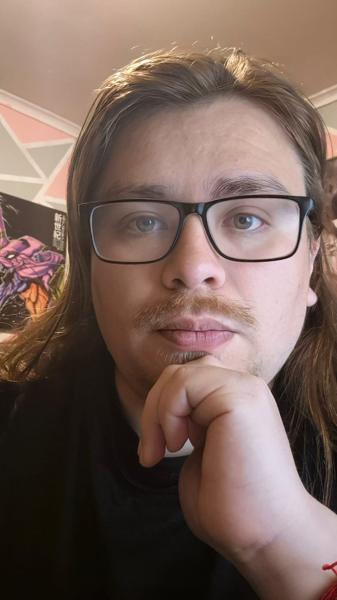

<section class="hero-section">
  

    <!-- Columna izquierda - Foto e información concisa -->
    

      
      

        

          9+
          Years in Game Dev
        

        

          Unreal Engine
          Unity
          Jira
        

      

    

    <!-- Columna derecha - Presentación -->
    

      <h1 class="hero-title">Senior Game Developer</h1>
      <h2 class="hero-subtitle">Technical Game Designer</h2>
      
Specialized in gameplay systems and interactive storytelling.

      

        
With over 9 years of experience in the indie game industry, I specialize in bridging the gap between design and implementation. I've contributed to every stage of game development—from pre-production and prototyping to post-production—leading development workflows, designing core systems, and building engaging level design experiences.

        
I have a strong focus on systemic design, interactive storytelling, and creating gameplay that feels meaningful and immersive.

      

      

          <button class="hero-action-button" onclick="downloadCV('Eng')">
              <i class="fas fa-download"></i>
              Download CV (English)
          </button>
          <button class="hero-action-button" onclick="downloadCV('Esp')">
              <i class="fas fa-download"></i>
              Descargar CV (Español)
          </button>
      

      <!-- Botón para bajar a la sección de experiencia -->
      

        View Experience
        

      

    

  

</section>

<!-- Sección de experiencia (inicialmente oculta visualmente) -->
<section id="experience" class="experience-section">
  

    <h1 class="section-title">Professional Experience</h1>
      

        <!-- Game Developer Role -->
        

          

            <i class="fas fa-gamepad role-icon"></i>
            <h2 class="section-subtitle">Game Developer</h2>
          

          

            
As a Game Developer, I have extensive experience integrating multiple gameplay systems across various genres including mobile games, action titles, and interactive novels.

            
My technical implementation skills include:

            <ul class="skill-list">
              <li>Developed and integrated core gameplay systems for mobile, action, and interactive narrative games</li>
              <li>Implemented automation systems for visual novel narrative design processes</li>
              <li>Created robust technical architectures supporting complex game mechanics</li>
              <li>Optimized performance across multiple platforms including mobile and PC</li>
              <li>Collaborated with cross-functional teams to ensure technical feasibility of design concepts</li>
            </ul>
          

        

        <!-- Technical Game Designer Role -->
        

          

            <i class="fas fa-drafting-compass role-icon"></i>
            <h2 class="section-subtitle">Technical Game Designer</h2>
          

          

            
As a Technical Game Designer, I specialize in designing gameplay system functionality through whiteboard sketches and paper prototypes, employing various modeling systems including UML to detail technical operations.

            
My design process includes:

            <ul class="skill-list">
              <li>Designed gameplay systems through whiteboard sessions and paper prototyping</li>
              <li>Created detailed technical documentation using UML and other modeling systems</li>
              <li>Structured gameplay mechanics with clear technical specifications for development teams</li>
              <li>Balanced creative vision with technical constraints to ensure feasible designs</li>
              <li>Iterated on designs based on playtesting feedback and technical requirements</li>
            </ul>
          

        

      

      <h2 class="section-subtitle">Technical Proficiencies</h2>
      

          

              <i class="fa-solid fa-u"></i>
              Unreal Engine (Blueprints)
          

          

              <i class="fa-brands fa-unity fa-xl"></i>
              Unity
          

          

              <i class="fas fa-book tool-icon"></i>
              Ren'Py
          

          

              <i class="fas fa-project-diagram tool-icon"></i>
              UML Modeling
          

          

              <i class="fas fa-mobile-alt tool-icon"></i>
              Mobile Development
          

          

              <i class="fas fa-code-branch tool-icon"></i>
              System Architecture
          

      

      <a href="#" class="back-button">
          <i class="fas fa-arrow-left"></i>
          Back to Portfolio
      </a>
  

</section>